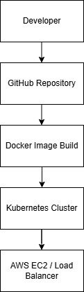

# AWS EKS Cluster using Terraform

## Architecture Diagram

## Project Overview
This project provisions an AWS EKS cluster and worker nodes using Terraform Infrastructure as Code.

## Tools Used
- Terraform
- AWS EKS
- EC2
- VPC
- Kubernetes
